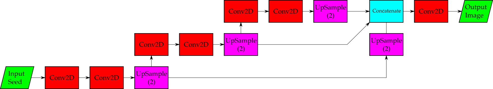
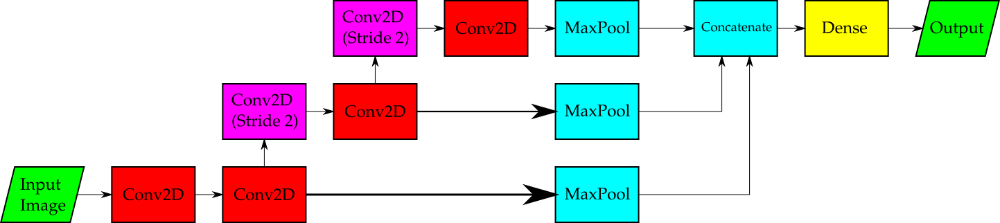
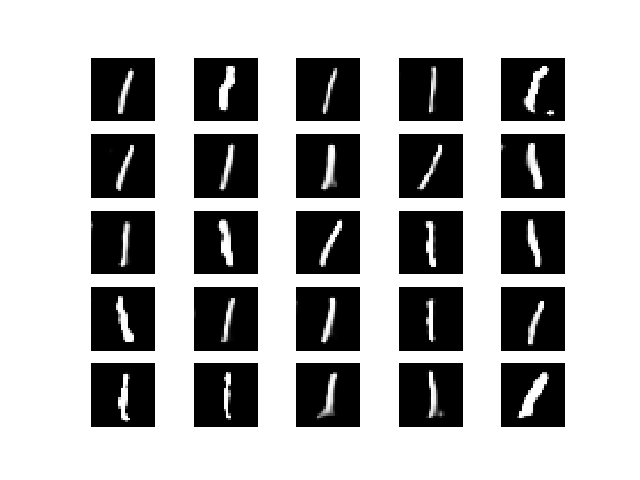

# One Generator

The purpose of this neural network was to produce pictures of ones. A one should be the easiest digit to draw, and if we cannot use our network to draw the number 1 then we should reconsider our approach.

The following is the architecture of the generator.

We start with a random seed. We then have the network learn low-resolution features, followed by mid-resolution features, then high-resolution features.

The low, mid, and high resolution features are combined in the last concatenation steps and convolutional layer. The motivation is that we can understand roughly what the image is at low resolutions, learn improvements to it at higher resolutions, and combine the resulting images to make a good image.

The following is the architecture of the discriminator.

We're given an image. We have the network learn high-resolution features, followed by mid-level features, then low-resolution features.

The low, mid, and high resolution features are then "scored" by taking the maximum across the channel - our MaxPool layers are designed to produce a single "score" for each channel. That is, it tells us how much of any given feature is present in the image.

These scores are then taken, concatenated together, and then fed into a dense layer to produce the classification.

The end result of training with the parameters in the code was the following set of ones.

This is an acceptable result for the time being. For reference, here is a collection of ones from the MNIST dataset used to train the network:

It is a bit worrying that the network did not learn to produce a 1 that had a base and stem, but there were vastly more "stick" ones in the training set. I am concerned about this apparent mode collapse, and think it may be best to move on to the 4 generator where this problem is more pronounced so I might fix it there. 